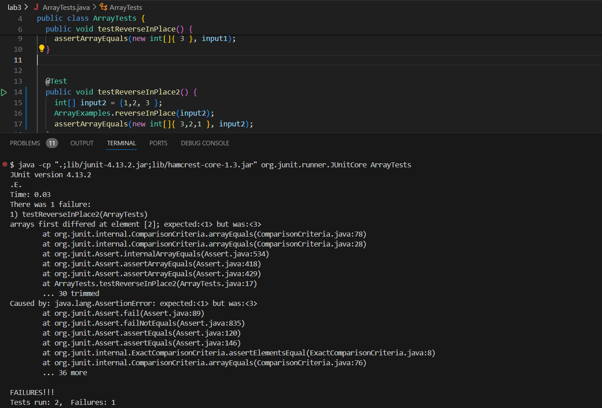

## 1.
### Failure inducing input

```
@Test 
public void testReverseInPlace() {
    int[] input1 = { 3 };
    ArrayExamples.reverseInPlace(input1);
    assertArrayEquals(new int[]{ 3 }, input1);
	}
```

### Not failure inducing input
```
  @Test
  public void testReverseInPlace2() {
    int[] input2 = {1,2, 3 };
    ArrayExamples.reverseInPlace(input2);
    assertArrayEquals(new int[]{ 3,2,1 }, input2);
  }
```

### running both 


### before and after

#### Before

```
  // Changes the input array to be in reversed order
  static void reverseInPlace(int[] arr) {
    for(int i = 0; i < arr.length; i += 1) {
      arr[i] = arr[arr.length - i - 1];
    }
  }
```

#### Fixed Code:

```
  // Changes the input array to be in reversed order
  static void reverseInPlace(int[] arr) {
    for(int i = 0; i < arr.length / 2; i += 1) {
      int toSwap = arr[i];
      arr[i] = arr[arr.length - i - 1];
      arr[arr.length - i - 1] = toSwap;
    }
  }
```

###  whut i did

It iterates only through the first half of the array and performs a swap operation with the mirroed othersize: For each element at index i, it finds its "mirror" element on the opposite side of the array by calculating array.length - i - 1 and swaps it. Its similar to the original faulty code, just that the one side is properly swapped over this time.

## 2. 

### ```-w```

```-w``` look for the entire word in the pattern
Source: https://phoenixnap.com/kb/grep-command-linux-unix-examples


```
$ grep -w 'microscopic' biomed/*.txt | head -10
```
```
biomed/1471-2105-3-26.txt:        traditionally based on microscopic appearance. Although
biomed/1471-2121-2-1.txt:          representative microscopic field were counted and the
biomed/1471-2121-2-10.txt:        are lost during specimen preparation for microscopic
biomed/1471-2121-2-10.txt:          cytoskeletal filaments for electron microscopic imaging.
biomed/1471-2121-2-15.txt:          examined the gross and microscopic appearance of skin
biomed/1471-2121-2-3.txt:        microscopic sections were evaluated with quantitative
biomed/1471-2121-3-19.txt:          observed via immunofluorescent microscopic observation of
biomed/1471-2121-3-21.txt:          microscopic images. Thirty-two fluorescence video images
biomed/1471-2121-3-4.txt:          For microscopic observation, cells were plated in
biomed/1471-2121-3-6.txt:          fluorescence microscopic observation immediately before
```
This command searches for "amylase" as a complete word in text files of the biomed directory (.txt) and shows the first 10 lines. This can be helpful if we are looking for a specific biological compound.(lots of bio terminology uses word componding like Pneumonoultra```microscopic```silicovolcanoconiosis)

```
grep -w 'process' 911report/*.txt | head -10
```
```
911report/chapter-10.txt:            The very process of reviewing these issues underscored the absence of an effective
911report/chapter-10.txt:                enforcement officials, who were following up on other leads. The clearance process
911report/chapter-11.txt:                process did not set, requirements to monitor such telltale indicators. Therefore the
911report/chapter-11.txt:                administrations. Each president considered or authorized covert actions, a process
911report/chapter-11.txt:                NSC-led interagency process did not effectively bring along the leadership of the
911report/chapter-12.txt:                themselves. The United States must support such developments. But this process is
911report/chapter-12.txt:                likely to be measured in decades, not years. It is a process that will be violently
911report/chapter-12.txt:                    rule at the national level, although that turbulent process does continue to
911report/chapter-12.txt:                    that process.
911report/chapter-12.txt:                strategies to promote the Middle East peace process. In each country, political
```
This command searches for the word "process" used in the text files of 911report and displays first 10 lines. This can be helpful if we are looking at certainn technical terms where it can also be conjugated, especially in analytical documents such as reports.

### ```-A```

'''-A #''' finds the # of lines after a certain pattern
Source: https://www.cyberciti.biz/faq/grep-in-bash/

```$ grep -A 2 "police" 911report/*.txt | head -5```
```
911report/chapter-10.txt:                of a military police lead vehicle and a van; the proposed briefing theater had no
911report/chapter-10.txt-                phones or electrical outlets. Staff scrambled to prepare another room for the
911report/chapter-10.txt-                President's remarks, while the lead Secret Service agent reviewed the security
--
911report/chapter-11.txt:                officials-local airport managers and local police departments- who had not seen such
```
This command searches for the word "police", and displays the line containing "police" along with the two lines following it in all files ending in .txt within the 911report directory, and showing the first 5 results. This can be useful if we are looking at the context before the usage of police in the 911reports


```$ grep -A 1 "CIA" 911report/*.txt | head -5```
```
911report/chapter-1.txt:    At the White House, the video teleconference was conducted from the Situation Room by Richard Clarke, a special assistant to the president long involved in counterterrorism. Logs indicate that it began at 9:25 and included the CIA; the FBI; the departments of State, Justice, and Defense; the FAA; and the White House shelter. The FAA and CIA joined at 9:40. The first topic addressed in the White House video teleconference-at about 9:40-was the physical security of the President, the White House, and federal agencies. Immediately thereafter it was reported that a plane had hit the Pentagon. We found no evidence that video teleconference participants had any prior information that American 77 had been hijacked and was heading directly toward Washington. Indeed, it is not clear to us that the video teleconference was fully under way before 9:37, when the Pentagon was struck.
911report/chapter-1.txt-
--
911report/chapter-10.txt:                proposed inserting CIA teams into Afghanistan to work with Afghan warlords who would
911report/chapter-10.txt:                join the fight against al Qaeda.46These CIA teams would act jointly with the
```
This command searches for the term "CIA" in all txt files in the 911report directory, shows the line containing "CIA" and the line following it, and showing the first 5 results. This can be helpful if we are also looking at the direct context before CIA being mentioned in the 911attacks

### ```-h```

```-h``` surpresses/hides the filenames in the output:
Source: https://stackoverflow.com/questions/1122218/to-understand-the-practical-use-of-greps-option-h-in-different-situations

```
$ grep -r -h "CIA" government | head -10
```
```
farmworker legal services. AMERICAN BAR ASSOCIATION, STUDY
A SPECIAL REPORT to CONGRESS�APRIL 30, 2000
COMMERCIAL SUPPLIERS
9.4.1 ROLE OF THE STATISTICIAN
TABLE 3. PREPARATION OF GP2 ARTIFICIAL SEAWATER USING REAGENT
9.4.1 ROLE OF THE STATISTICIAN
ANALYSIS OF THE SEA URCHIN, ARBACIA PUNCTULATA,
TO AUDIT OFFICIALS AND OTHERS INTERESTED IN GOVERNMENT AUDITING
FINANCIAL AUDITS
FIELD WORK STANDARDS FOR FINANCIAL AUDITS
```
This command searches for the ocurrences of the string pattern ```CIA``` of all files recursively in the government directory and its subdirectories and displays the top 10. 
It can be useful if we can visualize instances of CIA being mentioned and its roles/significance in the government records without getting bombarded by a bunch of textfile names.


```$ grep -h "3-2" biomed/*.txt | head -10```
```
          those with HF vs. 23-25% of those without; 
          column at either 4°C or room temperature (23-25°C).
          (amino acids 143-213 & 1266-1417, Figure 2) that
          interact with TOPIIIα. One of these regions (143-213) is
          Rab24 [ 24 ] fused to residues 163-201 from Rab1B [ 80 ]
          163-201 of Rab1B; Rab1B/Rab24, consisting of residues
          1993-2002. PHYLIP (Phylogeny Inference Package) version
          trp 1-190 leu2-3, 112 ura3-52 his3-200
        (NT_017021) of 6p21.3-22. Our 
        B:9-23 or B:13-23 [ 15 ] . However, in the Liu
```
This command searches for the occurrences of the string pattern ```3-2``` of all text files in biomed directory and displays the top 10.
It can be useful if we can visualize instances of 3-2, which can be a date, being mentioned and its roles/significance in the biomed publication without getting bombarded by a bunch of textfile names.

### ```-E``` 

```-E```  allows you to specify the search pattern you want to find in the text files.
Source: https://www.cyberciti.biz/faq/grep-in-bash/

```$ grep -E "Flight [0-9]{2}" 911report/*.txt | head -5```
```
911report/chapter-1.txt:    Between 6:45 and 7:40, Atta and Omari, along with Satam al Suqami, Wail al Shehri, and Waleed al Shehri, checked in and boarded American Airlines Flight 11, bound for Los Angeles. The flight was scheduled to depart at 7:45.
911report/chapter-1.txt:    In another Logan terminal, Shehhi, joined by Fayez Banihammad, Mohand al Shehri, Ahmed al Ghamdi, and Hamza al Ghamdi, checked in for United Airlines Flight 175, also bound for Los Angeles. A couple of Shehhi's colleagues were obviously unused to travel; according to the United ticket agent, they had trouble understanding the standard security questions, and she had to go over them slowly until they gave the routine, reassuring answers.
911report/chapter-1.txt:    Washington Dulles: American 77. Hundreds of miles southwest of Boston, at Dulles International Airport in the Virginia suburbs of Washington, D.C., five more men were preparing to take their early morning flight. At 7:15, a pair of them, Khalid al Mihdhar and Majed Moqed, checked in at the American Airlines ticket counter for Flight 77, bound for Los Angeles. Within the next 20 minutes, they would be followed by Hani Hanjour and two brothers, Nawaf al Hazmi and Salem al Hazmi.
911report/chapter-1.txt:    About 20 minutes later, at 7:35, another passenger for Flight 77, Hani Hanjour, placed two carry-on bags on the X-ray belt in the Main Terminal's west checkpoint, and proceeded, without alarm, through the metal detector. A short time later, Nawaf and Salem al Hazmi entered the same checkpoint. Salem al Hazmi cleared the metal detector and was permitted through; Nawaf al Hazmi set off the alarms for both the first and second metal detectors and was then hand-wanded before being passed. In addition, his over-the-shoulder carry-on bag was swiped by an explosive trace detector and then passed. The video footage indicates that he was carrying an unidentified item in his back pocket, clipped to its rim.
911report/chapter-1.txt:    Newark: United 93. Between 7:03 and 7:39, Saeed al Ghamdi, Ahmed al Nami, Ahmad al Haznawi, and Ziad Jarrah checked in at the United Airlines ticket counter for Flight 93, going to Los Angeles. Two checked bags; two did not. Haznawi was selected by CAPPS. His checked bag was screened for explosives and then loaded on the plane.
```
This command searches text files in the directory "911report" for lines containing "Flight" followed by exactly two digits, and displays the first 5 lines found. This can be helpful if we are looking for the specifics going on each flight involved in the 911 attacks.

```$ grep -E "([A-Z][a-z]{2,})-[0-9]{3,}" biomed/*.txt | head -5```
```
biomed/1471-2091-2-10.txt:          mAb directly conjugated to Alexa-488 revealed that α3β1
biomed/1471-2091-2-10.txt:          anti-α4-Alexa-488 mAb revealed a diffuse pattern of
biomed/1471-2091-2-10.txt:          no Alexa-488-conjugated antibodies were added, no
biomed/1471-2091-4-1.txt:          Microcon-100 (Amicon). The reaction mixtures were diluted
biomed/1471-2121-3-8.txt:        sequences are Gly-247, Gly-284 and Cys-450 in our Hyal-1
```
This command looks for lines containing patterns like "Name-number" (e.g., "isopropyl-1234") within text files in biomed within the "biomed" directory,  and then displays the first 5 lines found. This can be helpful if we are looking/gathering specific compound names in that format. 
